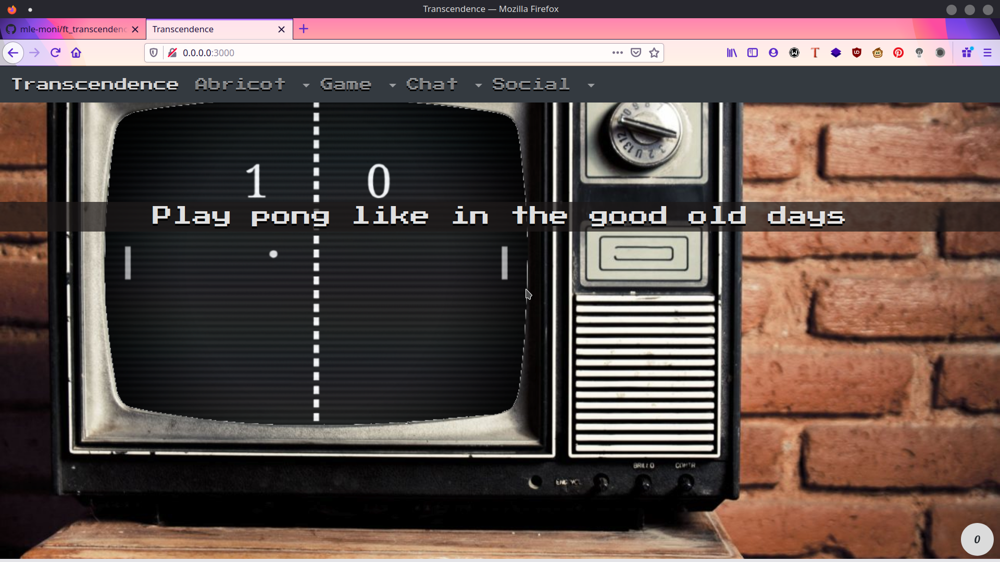
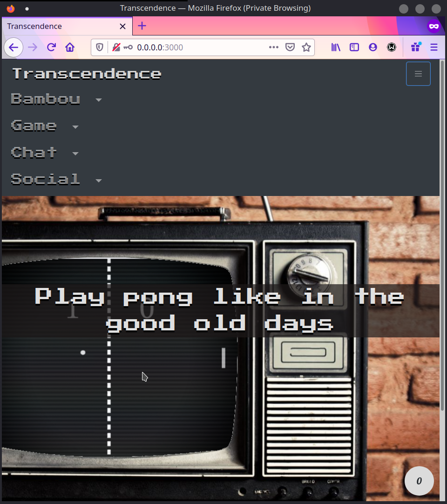
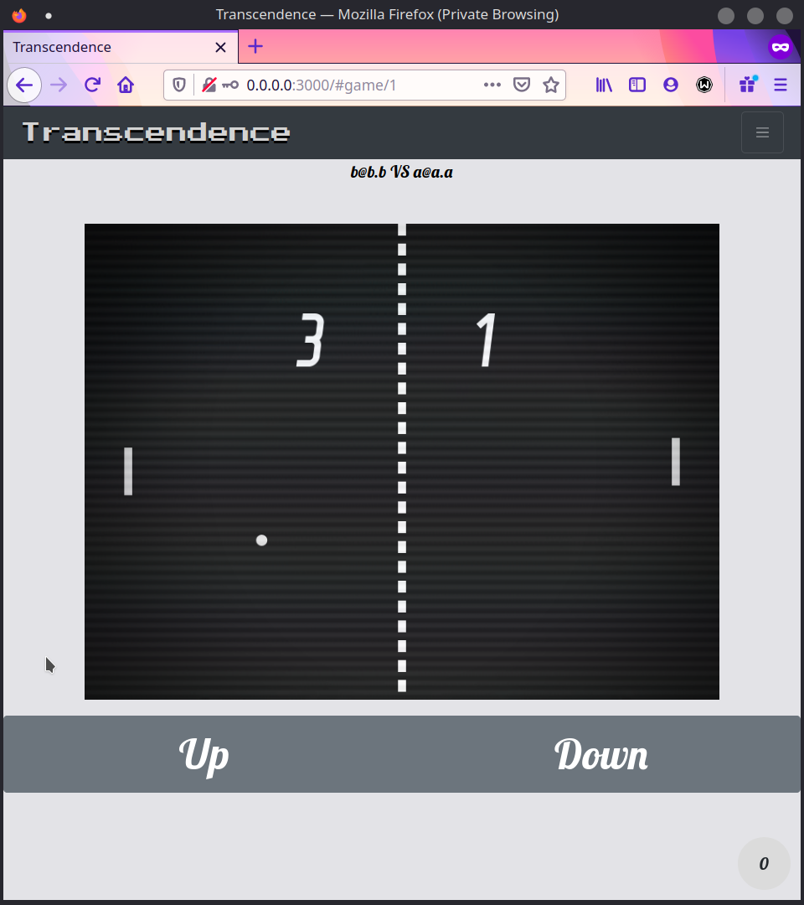
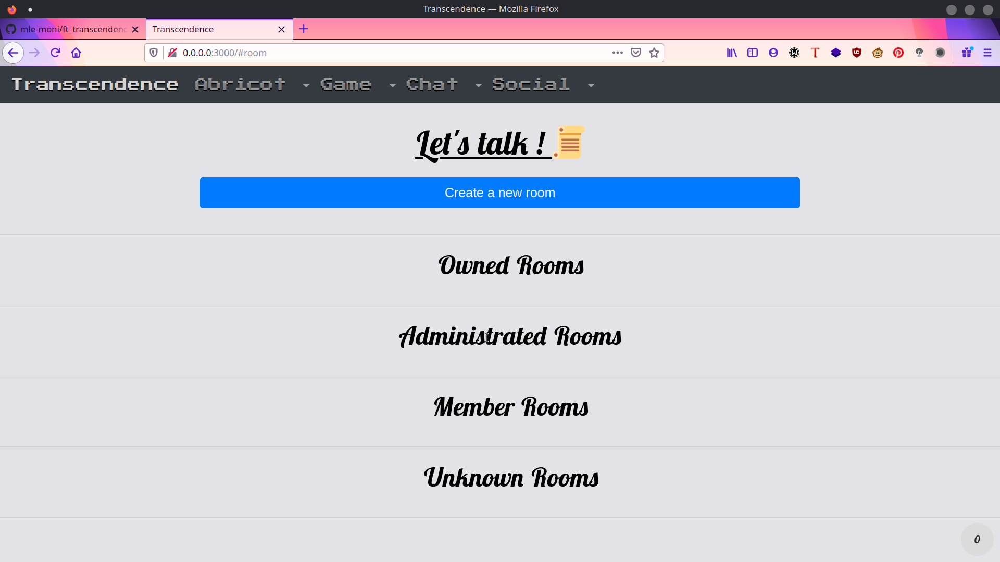
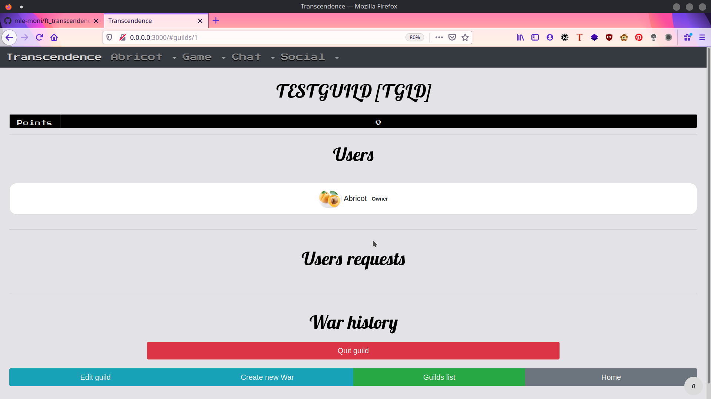

# ft_transcendence

## Here are some visual of the website :

## HOW TO GET THE APPLICATION RUNNING ON LINUX:

### install docker-compose:

arch: `sudo pacman -S docker-compose`

debian/ubuntu/etc..: `sudo apt-get install docker-compose` (not tested yet) 

### launch app: 
- `git clone https://github.com/mle-moni/ft_transcendence.git`
- `cd ft_transcendence`
- `sudo docker-compose up --build`

build without launch: `sudo docker-compose build`

launch without rebuilding: `sudo docker-compose up`

## RUN COMMANDS IN THE CONTAINER

`sudo docker-compose run web bash`

usefull to `bundle install`, `yarn add`, `rails db:migrate`, `rails g ...`, and so on

## HOW TO DEV ON THE PROJECT:

the folder that you created with git clone is mounted into the rails container, so you can work on the project by just editing files on your machine

if you need to reload the rails server, just `CTRL + c` to stop and `sudo docker-compose up` to get it working again

## CORRECTION REFERENCE:

Please respect the following rules:																									
- Remain polite, courteous, respectful and constructive throughout the evaluation process. The well-being of the community depends on it.																									
- Identify with the person (or the group) evaluated the eventual dysfunctions of the work. Take the time to discuss and debate the problems you have identified.																									
- You must consider that there might be some difference in how your peers might have understood the project's instructions and the scope of its functionalities. Always keep an open mind and grade him/her as honestly as possible. The pedagogy is valid only and only if peer-evaluation is conducted seriously.																									
																									
### Guidelines																									
- Only grade the work that is in the student or group's																									
																									
### GiT repository.																									
- Double-check that the GiT repository belongs to the student or the group. Ensure that the work is for the relevant project and also check that "git clone" is used in an empty folder.																									
- Check carefully that no malicious aliases was used to fool you and make you evaluate something other than the content of the official repository.																									
- To avoid any surprises, carefully check that both the evaluating and the evaluated students have reviewed the possible scripts used to facilitate the grading.																									
- If the evaluating student has not completed that particular project yet, it is mandatory for this student to read the entire subject prior to starting the defence.																									
- Use the flags available on this scale to signal an empty repository, non-functioning program, a norm error, cheating etc. In these cases, the grading is over and the final grade is 0 (or -42 in case of cheating). However, with the exception of cheating, you are encouraged to continue to discuss your work (even if you have not finished it) in order to identify any issues that may have caused this failure and avoid repeating the same mistake in the future.																									
- Remember that for the duration of the defence, no segfault, no other unexpected, premature, uncontrolled or unexpected termination of the program, else the final grade is 0. Use the appropriate flag. You should never have to edit any file except the configuration file if it exists. If you want to edit a file, take the time to explicit the reasons with the evaluated student and make sure both of you are okay with this.																									
- You must also verify the absence of memory leaks. Any memory allocated on the heap must be properly freed before the end of execution. You are allowed to use any of the different tools available on the computer, such as leaks, valgrind, or e_fence. In case of memory leaks, tick the appropriate flag.																									
																									
### Verifications																									
- Check if all the necessary configuration files of the server are in the folder srcs.
- Check if the Dockerfile is at the root of the repository.																									
- Run the "docker-compose up -build" command.																									
- Since this project has a little more flexibility in the rating, do not stop the evaluation unless you encounter a 500 error, a crash, or anything actually not working in the project.																									
																									
### Backend																									
- The backend must be done using Ruby on Rails 6.X.X																									
- The database must be a postresql database 12.1																									
- During the whole evaluation, there must be no unhandled warning or error																									
																									
### Frontend																									
- The frontend must be done using backbonejs, version 1.4.X																									
- Any javascript library is allowed, however no other framework is permitted																									
- During the whole evaluation, there must be no unhandled warning or error																									
																									
### Basic check																									
- There is a website, available at the adress of choice of the students																									
- A user can login using the 42 OAuth feature																									
- When first logged, user is prompted to add informations on his account (display name, avatar...)																									
- When not logged, user is prompted to log in and has access to little to no informations																									
- The site uses the "Single Page Application" system. The user still can use the "Previous/Next" buttons of their browser.																									
- The site is accessible using the latest version of Chrome, Firefox or Safari without any problems or errors.																									
																									
## The website																									
																									
### Security concerns																									
- Make sure that the website is secured. Check the database to verify that passwords are encrypted, check the server for server-side validation/sanitization on forms and any other user input. If this isn't correct, the evaluation ends																									
																									
### User admin interface																									
- When logged in, the user has access to his admin panel where he can change informations about himself, including its nickname (must be unique across the users of the website), his avatar (initially an automatically generated avatar)																									
																									
### Users interfaces																									
- They can see the profile of other users, containing basic informations such as their nickname, their avatar, their guild, add them as friends, invite them to their guild (with the appropriate rights).																									
- User can block other users, and won't receive their private messages nor view their messages in public/private channels.																									
																									
### Friend interface																									
- User has access to a friends interface, where he can see his friends, their status (offline/online/in a game), and has access to basics informations about them (name, avatar, potentially guild...)																									
																									
### 2FA																									
- User can enable/disable 2 factor authentification (2FA) and, if enabled, must use it to connect to the website.
- 2FA must use google authentificator, SMS, mail...																									
																									
### Chat interface
- Joining/leaving channels																									
- A logged in user can access the website chat service.																									
- Joining/leaving channels is a manual action, and must not be done on logout (user must click something like "Leave channel")
- User can access already created channels, and can discuss in it. If a password is needed, it must be provided to access the channel.

#### Chat usage																									
- Users can chat. Messages must be sent/received instantly.																									
- If the user blocked another user, their messages must not be visible.																									
- User can access the user profile of other players in the chat, and duel them for a pong game.

#### Creating channels																									
- User can create new channels, in which he'll be owner with basic moderations rights (ban/mute users, add password to the channel, set new administrators...)																									
																									
#### Administration																									
- When owner of a channel, user can kick, ban, mute other users and administrators																									
- When administrator of a channel, user can kick, ban mute other users, but not owners

### The Guild system																									
																									
#### Guild creation																									
- There must be a guild system.																									
- When a user is not in a guild, the user can create his own guild, choose his name and handle (4 characters)

#### Guild invitations																									
- If the user has the appropriate rights, he is allowed to invite users without guild to his guild.
- User can accept/refuse the guild invitation																									
																									
#### Guild ranks																									
- There must be a guild master, officers, and one or more "member" ranks.																									
- Guild master and officer an manage the guild, add/remove users, and other guild managing stuff. 

#### Guild points																									
- A guild has points, brought in by its users. Whenever a user wins a match or a tournament, points are added to the guild points' pool.																									
- There must be some kind of ranking of all the guilds, visible to any logged-in user.

### Website Administration

#### Website owner/moderators																									
- There is a website owner. He can appoint moderators who will have the same rights as him (besides removing him from owner)

#### Through an administration page, moderators & owner can:																									
- Destroy channels																									
- Ban users from the website																									
- See all chat channels (without joining)																									
- Give or remove rights to a chat channel to a user																									
- Give or remove rights to a guild to a user																									
- Create tournaments (more on that later)																									
																									
### The game itself																									
																									
#### Matchmaking																									
- When logged in, the user has access to a matchmaking system in which he can play pong games versus other players on the website.
- The ruleset is available somewhere on the website and can be consulted by users.																									
- When you find a match, you must be loaded in the game and start playing.																									
																									
#### Gameplay																									
- The game itself must be playable, respecting the ruleset created by the users of the website. Ruleset should be available somewhere on the website.																									
- The controls must be intuitive or correctly explained (no cluncky controls or something of the sort)
- When the game is finished, user must be brought to some kind of end-game screen, or simply exit the match.

#### Spectactor mode																									
- There is a spectator mode, a user can watch any live game, through the chat interface, friend interface or guild interface.
- There can be a page dedicated to viewing live games from which the user can access any game.

#### Lags & disconnects																									
- Disconnects and lags are handled. The game and the website must not crash when a user is experiencing lags or is disconnected.
- Handling lags or disconnects in an efficient way is appreciated but not mandatory:
  - Have the game pause for a set time																									
  - Disconnected user can reconnect																									
  - Lagging user can catch up to the match																									
  - etc																									
Any way is acceptable, your game simply must not crash.																									
																									
#### Additionnal features																									
- The user can add various features like power-ups, boosts, duel-player or anything that comes to mind. If there are such modifications, you can choose which to enable for duels/tournaments.

#### Ladder																									
- There must be a permanent ladder system on which the users can play, with a ranking system. Users can play on ladder or casual, which will have no impact on their ladder rating.																									
																									
#### Tournament																									
- Owners/administrators of the website can create tournaments.																									
- When a tournament is created, user can register to it before it starts.																									
																									
#### Guild Wars																									
																									
##### The basics																									
- Guilds can declare war to each others. Both guilds need to accept the terms of the war before it begins.
- A war has a start date, an end date, and a number of points in play, from each guilds.	
- Guilds must also agree upon any power-ups or other addons that might be available on the website.
- A guild can only start a war if it's not at war with another guild and the timetables aren't conflicting

##### War Time																									
- War times and time to answer must be agreed upon at start aswell.																									
- During war time, if no "war time" match is running, any member from one of the guild can ask to fight someone from the other guild.
- If there is no answer before the "time to answer", the match is automatically won. Else, the match is fought.
																									
##### War effort
- Guilds can choose which kind of matches count towards the war. Ladder, tournament, duels, which addons or powerups must be enabled... If a player meets a player from the opposing guild in a match, the points must be counted accordingly.

##### War points																									
- When a match ends, the winner's guild gets war points.																									
- When a match is forfeited, the winner's guild gets war points.																									
																									
##### War resolution																									
- War ends based on the time chosen at the beginning of the war.																									
- The winning guild gets the agreed-upon points from the losing guild.																									
- The war must be visible on the guild war history page																									
																									
#### Ratings																									
Don't forget to check the flag corresponding to the defense
